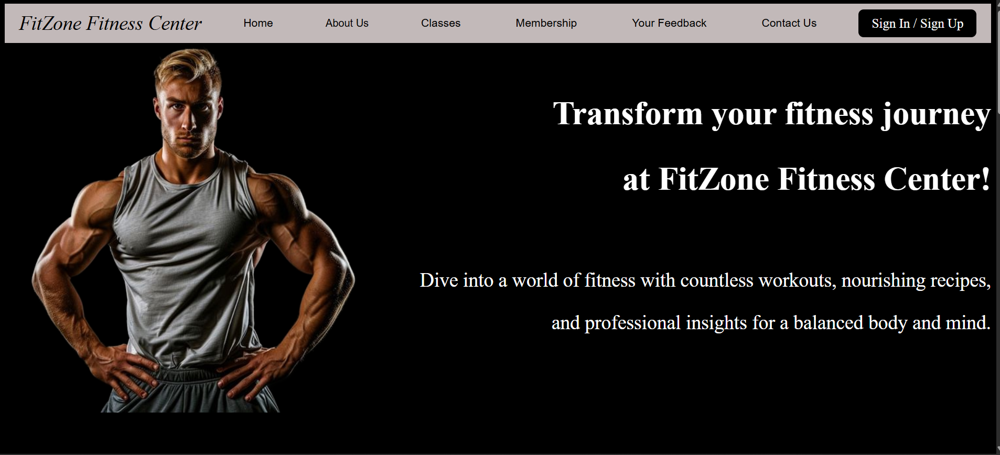
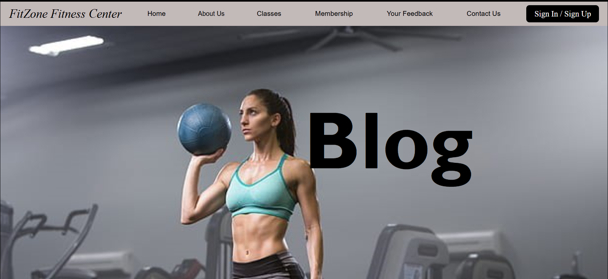
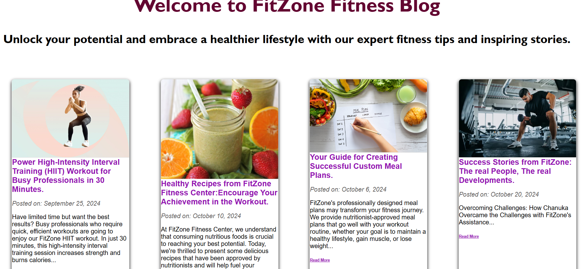
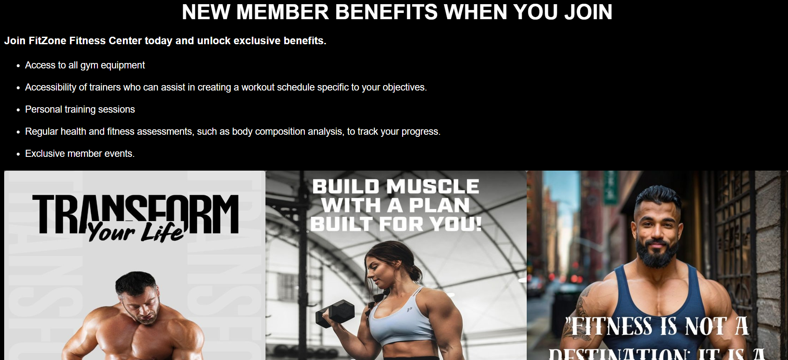
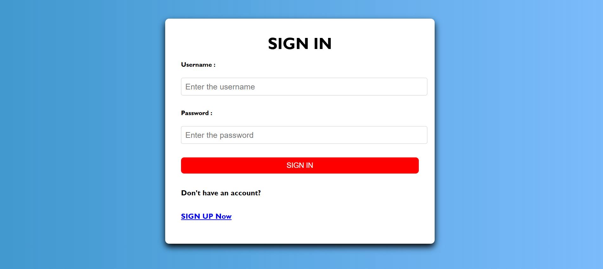
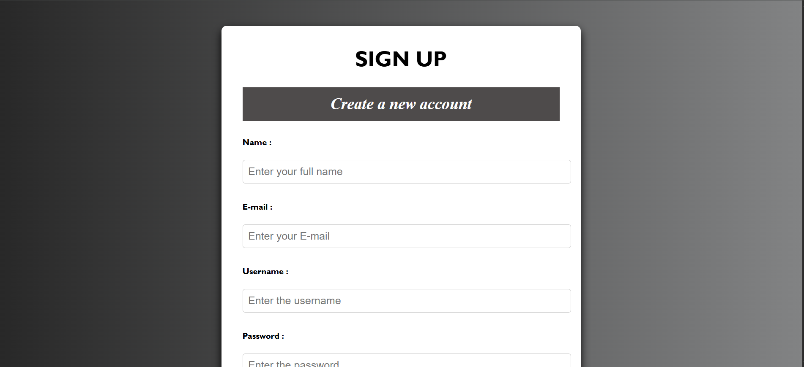
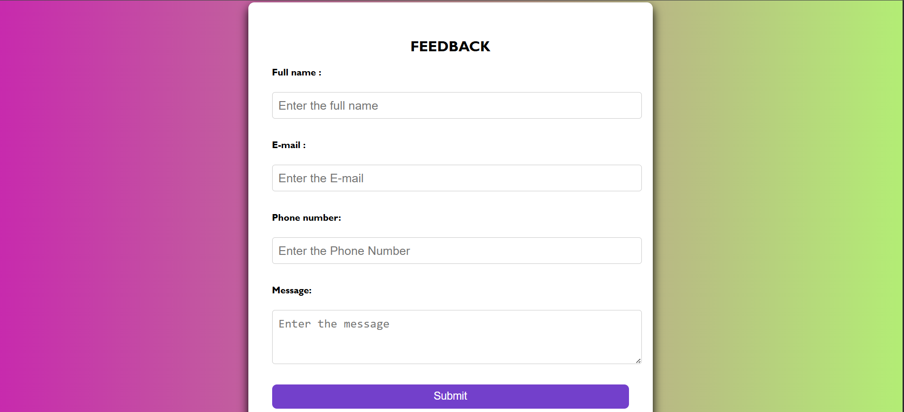
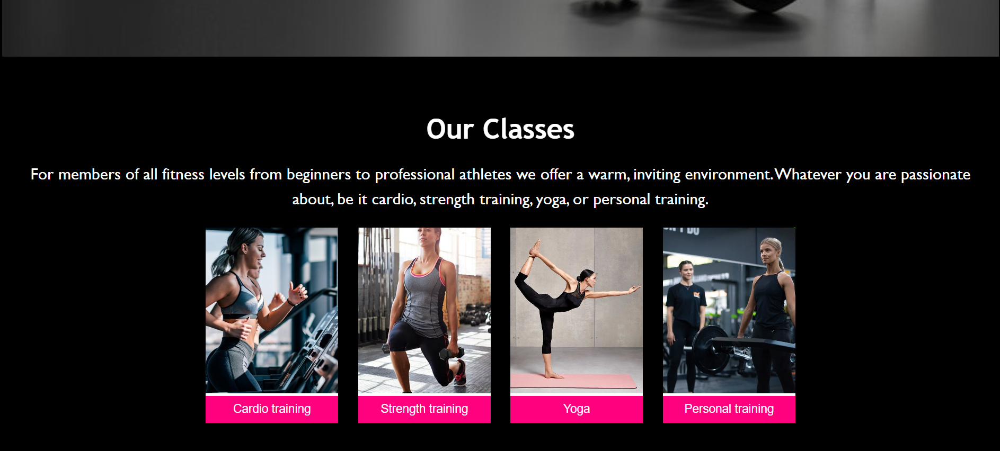
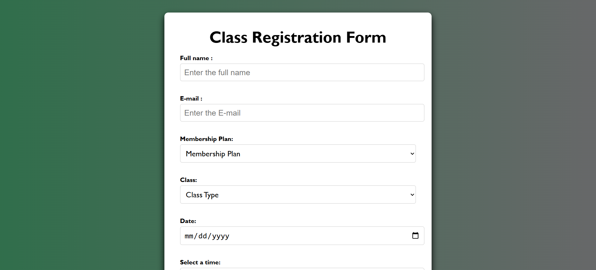

# FitZone Fitness 🏋️

<section style="max-width: 800px; margin: 0 auto; padding: 20px; font-family: Arial, sans-serif;">
  <h1>💻 FitZone Fitness</h1>
  
<strong>FitZone Fitness</strong> is a web platform designed for a fitness center that allows customers to manage their memberships, join classes, view schedules, provide feedback, and interact with staff through messages. It includes login and registration functionalities, class joining features, and a blog section with fitness tips, workout routines, and healthy recipes. 💪

   
  
✨ This is my very first website project! I built it using core web technologies <strong>PHP</strong>, <strong>HTML</strong>, <strong>CSS</strong>, and a bit of <strong>JavaScript</strong> without any frameworks. A big learning experience and a project I'm really proud of!

</section>

## Features ✨

- **🔐 Login/Registration**: Customers, staff, and admins can register and log in to their respective accounts.
- **📅 Class Management**: Customers can view available classes and join them.
- **💬 Message System**: Staff and admin can send messages to customers.
- **📢 Feedback System**: Customers can submit feedback, and admins can respond to them.
- **📚 Blogs**: A section for fitness-related blogs, workout routines, and healthy recipes.
- **ℹ️ About Us**: Information about FitZone Fitness Center.

## Screenshots 📸

Below are some screenshots of the website: 

| Homepage                             | Blog Page                                                   |
|-------------------------------------|-------------------------------------------------------------|
|  |   |

| Membership Page                           |
|-------------------------------------------|
|    |

| Login Page                           | Register Page                         |
|--------------------------------------|----------------------------------------|
|  |   |

| Feedback Page                        | Class Page                             |
|--------------------------------------|----------------------------------------|
|  |  |

| Join Class Page                      |
|--------------------------------------|
|   |

 <strong>🌟 If you find this project useful, please consider starring the repository!</strong>  <strong>

